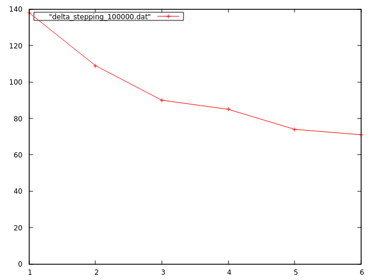
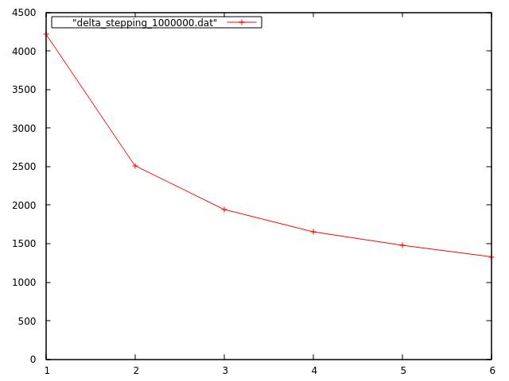
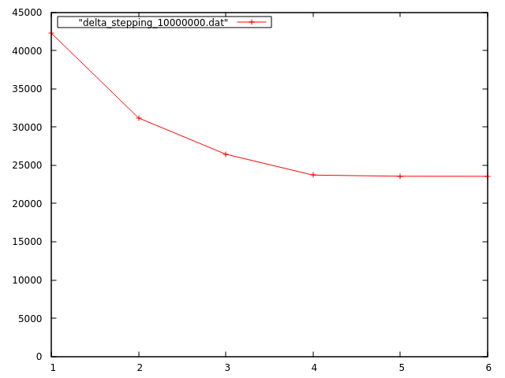
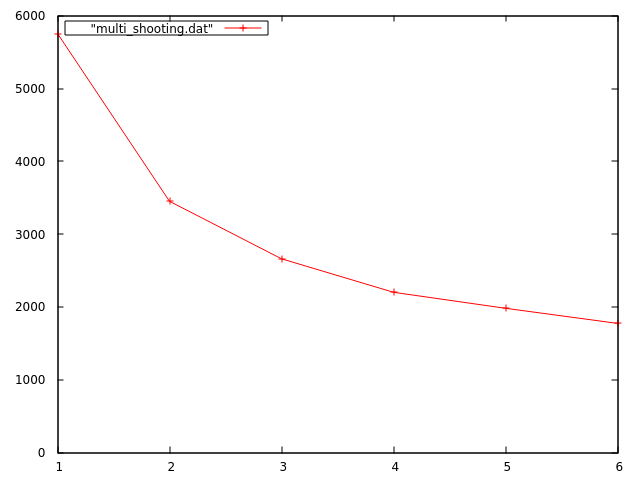
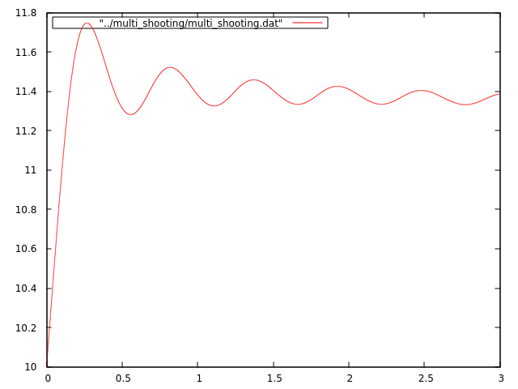

##Sort
###1 process

1000 -> 0.00user 0.00system 0:00.00elapsed 0%CPU

50000 -> 0.06user 0.00system 0:00.08elapsed 74%CPU

1000000 -> 1.08user 0.03system 0:01.26elapsed 88%CPU

5000000 -> 5.65user 0.09system 0:06.31elapsed 91%CPU

###2 processes

1000 -> 0.00user 0.00system 0:00.00elapsed 100%CPU

50000 -> 0.07user 0.00system 0:00.08elapsed 82%CPU

1000000 -> 1.12user 0.01system 0:01.04elapsed 108%CPU

###6 processes

1000 -> 0.02user 0.00system 0:00.00elapsed 311%CPU

50000 -> 0.10user 0.00system 0:00.07elapsed 131%CPU

1000000 -> 1.24user 0.02system 0:00.91elapsed 138%CPU

5000000 -> 6.36user 0.06system 0:04.54elapsed 141%CPU

##Matrix Multiplication
###1 process

100 -> 0.05user 0.00system 0:00.15elapsed 37%CPU

300 -> 0.83user 0.01system 0:01.10elapsed 76%CPU

800 -> 13.63user 0.03system 0:14.96elapsed 91%CPU

###2 processes

100 -> 0.05user 0.00system 0:00.14elapsed 39%CPU

300 -> 0.89user 0.00system 0:00.78elapsed 114%CPU

800 -> 14.56user 0.02system 0:09.27elapsed 157%CPU

###6 processes

100 -> 0.10user 0.00system 0:00.14elapsed 72%CPU

300 -> 1.02user 0.00system 0:00.59elapsed 173%CPU

800 -> 17.24user 0.01system 0:05.35elapsed 322%CPU

##Delta-Stepping

##Multiple Shooting

